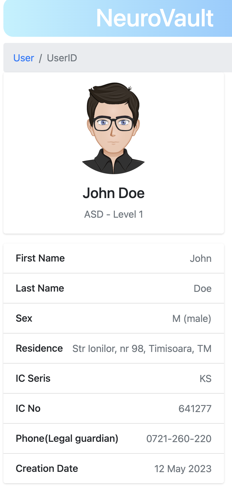
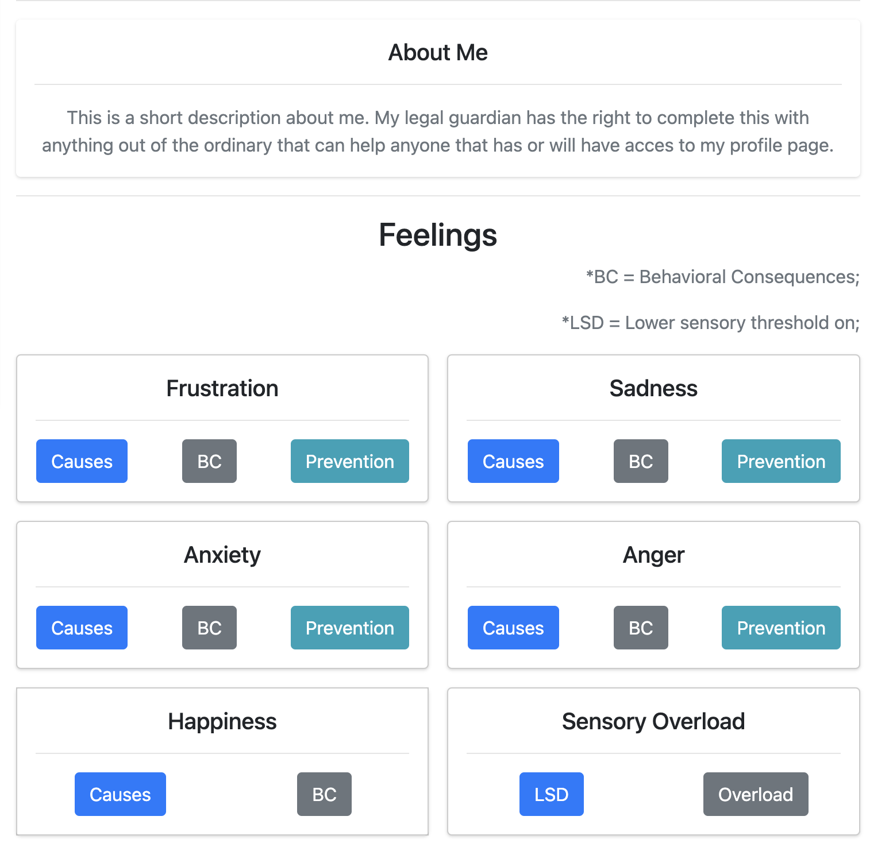
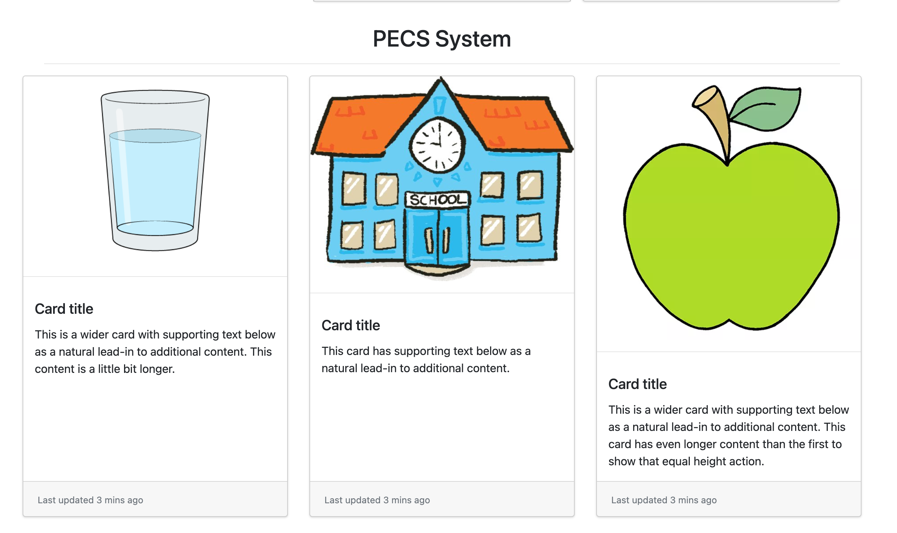

 # NeuroVault

NeuroVault is a web platform dedicated to autistic individuals, which helps these people integrate into the society.

## Status Quo
- 75000000+ People are diagnosed with autism all over the world
- The number of diagnosed cases increased by 178% since 2000
- 1 in 36 kids are diagnosed with autism in U.S
- 1/3 of people diagnosed with autism are non-verbal or minimal verbal
- 40% suffer from Anxiety and 61% of ADHD

## NeuroVault features

Our goal was to create a platform that helps people with autism integrate into the society by communicating and by offering support in helping them. 

### Behaviour Predictions
We wanted to offer the possibility of possible behaviour prediction from people with autism. Specialist can record data of their pacients in the platform and analyze it in time. 

This would make future specialists that interact with autistic people understand better the way their pacients are communicating.   

### PECS System
The Picture Exchange Communication System (PECS) is a form of augmentative and alternative communication primarily used to help individuals with autism and other communication disorders develop functional communication skills.

## Project development 
We have used web technologies for creating this platform: HTML, CSS, JavaScript, PHP. For the database, we have used PostgreSQL.  

## Team members 
- Vlad Tomici -> Backend Development
- Cosmin Murariu -> Frontend Development
- Marian Bogdan -> Design + Research

HackTM 2023

